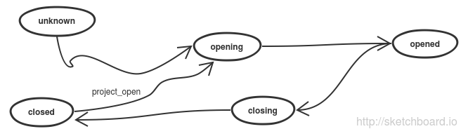
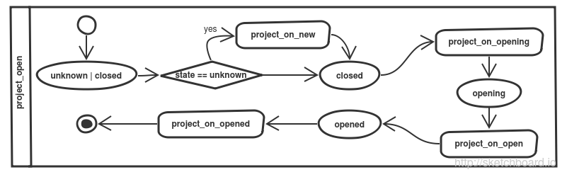
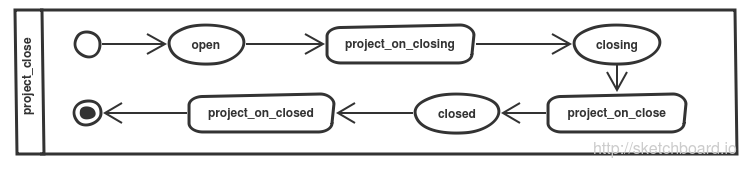
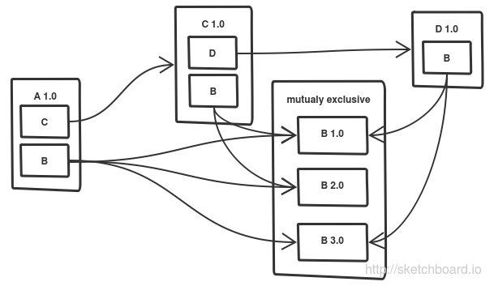

# Project


## Motivation

Managing packages which are not part of you own source tree is a troubling task when it needs to work on all platforms and without hassle. For many programming languages there exist tools which handle the search, retrieval and management of packages.  For `CMake` there exists something rudimentary like `Modules`, `Config` and `ExternalProject`.  However these are do not really  manage a dependency graph and or not formulated all too concisely.  

I was inspired by great dependency managers like `npm` and `nuget`.  (Also: `maven`, `pip`, `apt-get`, ...)  They really make it easy to use and share packages.  Also the ideas behind `ryppl` were very interesting to me.

I however wanted a dependency manager which works with out-of-the-box cmake and does not have any initial dependencies.  

The reason to use cmake as the basis is because of its platform independence and because it can be viewed as the root dependency of everything (you can use cmake to build everything on almost every platform).  I coerced cmake into a usable form for a complex dependency manager by providing a lot of missing functionality. 

## Requirements

I require decentralized package sources - git, svn, hg,svn, github, bitbucket, archives, remote archives, local folders, ....  I do not want a central service as it does not reflect how c++ projects are organized at the moment.  Also I want to have the possibility of adding new package sources as the need for them arises (apt-get, brew, convention based (like cmake's module files),... ). These package sources only perform two things: search and retrieval.  They take a normalized input in `uri` form which can identify any package in the world and return metadata and content in a consistent interface.  This part of the dependency management is implemented in my [package source functions](../package_source).

The dependency management part is required to be completely separated from the `<package source>`s. It shall use the metadata provided by the package sources to calculate a dependency configuration (with complex constraints like versioning, incompatibilities, optional dependencies, OS and location based constraints ...) and manages the materialization and dematerialization of these packages while still being easily extensible.

The `project functions` need to be usable from within any cmake script so that build automization becomes possible while also providing an easy to use and intuitive command line client that the dev can use to control his or her project.

## Design Choices

The project functions are based on a `project handle` which is also a `package handle` as use by the package sources.  The `project handle` contains all information about a project and needs to be serializable and portable. Also it may be extended by custom data.

To keep the project functions open for extension but closed for modification I chose to use an event system to emit events to which extensions can react and modify the project and package handles according to their requirements.  The project lifecycle is defined by these events.  The state of the project always needs to be correct which is why I also use a state machine to manage it.

### The Project Lifecycle

The project lifecycle is at its base very simple with just five states:




When a new project handle is created it is in the `unknown` state and will first be set to `closed` before entering the lifecycle.  The project handle can only be persisted and read when it is in the `closed` state otherwise it is considered to be in an inconsistent state.


### Datatypes:

```
<project handle> ::= <package handle> v { # see package sources for information
  uri: "project:root" # your project is always addressable as "project:root"
  content_dir: <absolute path> also called the `project_dir`
  project_descriptor: <project descriptor> 
  package_descriptor: <package descriptor> # see package sources for information
  materialization_descriptor: <materialization descriptor> # stores information on were and how data of the package is stored
  ...
}
```

The project descriptor contains data which describes the state of the project. 
```
##all <relative path>s are relative to the `project_dir` unless stated otherwise
<project descriptor> ::= {
   package_cache: { <admissable uri> : <package handle> } # contains all packages known to project
   package_source: <package source> a package source object used to retrieve package metadata and files.
   package_materializations: { <package uri> : <package handle> } # contains all materialized packages.
   dependency_configuration: { <package_uri> : <bool> } # the currently configured dependencies
   dependencies: { <package uri>:<package handle> } # all dependencies that this project has including transient dependencies. 
   dependency_dir: <relative path = "packages"> # path relative to project root which is used as a the default dependency locations
   config_dir: <relative path = ".cps"> # the locations of the configuration folder 
   project_file: <relative path = ".cps/project.scmake"> # the location of the project's config file
   package_descriptor_file: <relative path>?  # if specified the path of the package descriptor.  This will be read or written when project is opened or closes
   ...
}
```


## Implementation

### The Commmand Line Interface

The command line interface wraps these functions and provides an alias which you can use from your console of choice.  Its usage is described here:

```
```


### Opening and Closing a Project

When a project is opened the following will happen (the ovals are states and the boxes are events that are emitted):




Closing happens in a inverse fashion but will never result in an unknown state:




Two wrappers for open and close exist: `project_read` and `project_write` which makes it easier to open a project file and save. It is also noteworthy to say that project close removes any none portable data and project open restores it.

Here is the list of functions


* [project_open](#project_open)
* [project_close](#project_close)
* [project_read](#project_read)
* [project_write](#project_write)

### The Project is `opened`

When the project is `opened` it is possible to modify and work with it. The functions which are available are as follows:

#### Materialization


A project can materialize and dematerialize packages which may or may not be dependencies. What this means is that adding or removing a dependency is not the same thing as materializing and dematerializing a dependency. This split between materialization and dependency management may seem strange at first but it allows you more manual control.


* [project_materialize](#project_materialize)
* [project_dematerialize](#project_dematerialize)
* [project_materialize_dependencies](#project_materialize_dependencies)


#### Dependency Management

The actual dependency manager I implemented is based on every package defining its dependency constraints which are then combined into a large boolean satisfyability problem.  The solution to this problem is called the dependency configuration.  The big advantage that using a SAT solver over a topological order is that it allows cyclomatic dependendencies and can solve ambiguous dependencies (it actually just has to find one set of dependencies which work).  The dependency configuration then a  simple map which maps `{ <package uri> : <bool> }` 

The following figure illustrates a problem which will be solved by the SAT solver.  The packages dependencies specified in the packages all have constraints which can be fulfilled by multiple instances of package B.  However there is a consensus candidate which will solve the problem for all packages in the dependency graph:




A package dependency is defined as follows: 

```
<package dependency> ::= { <admissable uri> : <package constraint> }
## example:
{ 'github:toeb/cmakepp':true }
{ 'http://www.cmake.org/files/v3.2/cmake-3.2.1.tar.gz':false }
{ 'bitbucket:toeb/test_repo_hg':null}
{ 'github:toeb/cppdynamic':{ ... } }
```


These package dependencies can be combined:

```
<package dependencies> ::= <package dependency> v <package dependency>
```

##### Package Constraints
A package constraint is defined as follows:
```
<package constraint> ::= <true> | <false> | <null> | <complex package constraint>
<complex package constraint> ::= {
  ... values that configure or constrain the packges ...
}
```

The simple constraints are easy to explain:
* `true` the dependency is necessary. any `package uri` which is identified by  the `admissable uri`  will fullfill the dependency for the current package.
* `false` any `package_uri` identified by the `admissable uri` is incompatible with the current package.
* `null` any `package uri` identified by `admissable uri` can be optionally installed. (same as complex contstraint `{is_optional:true}`)
*  `{ ... }` complex constraints are not completely implemented yet (only `is_optional`) but I plan to add version constraints, installation location constraints, os dependencies, dependency descriptor modifications. Also may contain any other proeprties which can be used by extensions to configure that particular project/package/package dependency.  See for example the `package symlinker` extension. 


###### Functions 


* [project_change_dependencies](#project_change_dependencies)


## Extensions to the Project Lifecycle

In the metadata for every package (ie the `package_descriptor`)

### `CMake` extension

You 

## `cmakepp` integration

`cmakepp` listens for the project events and uses them to to provide extra functionality which is described here

* `package_descriptor.cmakepp.create_files : { <filename> : <filecontent> }` all keys specified here will be created in the `package`'s `content_dir` with the specified content. This is useful if you want to define a package completely in a `package descriptor`
* `package_descriptor.cmakepp.export : <glob ignore expression>` includes all the files specified by the glob ignore expression in cmake allowing your package to provide cmake macros and functions to other packages.  **WARNING** cmake only has one function scope so you need to be careful that you do not overwrite any functions which are needed elsewhere.  The best practice would be for you to add a namespace string before each function name e.g. `mypkg_myfunction`.  

### Package `hooks`

Hooks are invoked for every package which allows it to react to the project lifecycle  more easily.  These hooks are called using `package_handle_invoke_hook`. You can use any function that you defined in your `cmakepp.export`s (except if stated otherwise) and also specify a file relative to the `package`'s root direcotry. 

* `package_descriptor.cmakepp.hooks.on_loaded`  called after a package and all its dependencies are loaded.  You can also load custom data here or setup the project / package.
* `package_descriptor.cmakepp.hooks.on_unloading` called when the package is unloaded.  You can store all information that you want to keep in the `package_handle`. Or you could use this hook to persist custom data 
* `package_descriptor.cmakepp.hooks.on_materialized` called after the package content is available but before the package is loaded. Here you can only specifiy a script file because the exports might not be available (but you can include them yourself)
* `package_descriptor.cmakepp.hooks.on_dematerializing` called before the package dematerializes. this allows you to perform cleanup before the package content is destroyed
* `package_descriptor.cmakepp.hooks.on_run` called on project package if when command line client is invoked (see `cmakepp_project_cli`)
* `package_descriptor.cmakepp.hooks.on_ready` is invoked when all become ready and the package itself is materialized
* `package_descriptor.cmakepp.hooks.on_unready` is invoked if any dependency becomes unready


## Function Descriptions

## <a name="project_open"></a> `project_open`

 `(<content_dir> [<~project handle>])-><project handle>` 

 opens the specified project by setting default values for the existing or new project handle and setting its content_dir property to the fully qualified path specified.
 if no project handle was given a new one is created.
 if the state of the project handle is `unknown` it was never opened before. It is first transitioned to `closed` after emitting the `project_on_new` event.
 then the project handle is transitioned from `closed` to `open` first the `project_on_opening` event is emitted followed by `project_on_open`.  Afterwards the state is changed to `open` and then the `project_on_opened` event us emitted.  
 returns the project handle of the project on success. fails if the project handle is in a state other than `unknown` or `closed`. 
 
 *note* that the default project does not contain a package source. it will have to be configured once manually for every new project


 **events**
  * `project_on_new(<project handle>)`
  * `project_on_opening(<project handle>)`
  * `project_on_open(<project handle>)`
  * `project_on_opened(<project handle>)`
  * `project_on_state_enter(<project handle>)`
  * `project_on_state_leave(<project handle>)`
  * extensions also emit events.

 **assumes** 
 * `project_handle.project_descriptor.state` is either `unknown`(null) or `closed`
 
 **ensures**
 * `content_dir` is set to the absolute path of the project
 * `project_descriptor.state` is set to `open`


## <a name="project_close"></a> `project_close`

 `(<project handle>)-><project file:<path>>`

 closes the specified project

 **events**
  * `project_on_closing(<project handle>)`
  * `project_on_close(<project handle>)`
  * `project_on_closed(<project handle>)`


## <a name="project_read"></a> `project_read`

 `(<package handle> | <project dir> | <project file>)-><project handle>`
 
  Opens a project at `<project dir>` which defaults to the current directory (see `pwd()`). 
  If a project file is specified it is openend and the project dir is derived.  
 
  Checks wether the project is consistent and if not acts accordingly. Loads the project and all its dependencies
  also loads all materialized packages which are not part of the project's dependency graph
 
 **returns** 
 * `<project handle>` the handle to the current project (contains the `project_descriptor`) 
 
 **events**
 * `project_on_opening(<project handle>)` emitted when the `<project handle>` exists but nothing is loaded yet
 * `project_on_open(<project handle>)` emitted  so that custom handlers can perform actions like loading, initializing, etc
 * `project_on_opened(<project handle>)` emitted after the project was checked and loaded
 * events have access to the follwowing in their scope: 
   * `project_dir:<qualified path>` the location of this projects root directory
   * `project_handle:<project handle>` the handle to the project 


## <a name="project_write"></a> `project_write`

 saves the project 


## <a name="project_materialize"></a> `project_materialize`

 `(<project handle> <volatile uri> <target dir>?)-><package handle>?`

 materializes a package for the specified project.
 if the package is already materialized the existing materialization handle
 is returned
 the target dir is treated relative to project root. if the target_dir
 is not given a target dir will be derived e.g. `<project root>/packages/mypackage-0.2.1-alpha`

 returns the package handle on success
 
 **events**: 
 * `[pwd=target_dir]project_on_package_materializing(<project handle> <package handle>)`
 * `[pwd=target_dir]project_on_package_materialized(<project handle> <package handle>)`

 **sideffects**:
 * `IN` takes the package from the cache if it exits
 * adds the specified package to the `package cache` if it does not exist 
 * `project_handle.project_descriptor.package_materializations.<package uri> = <materialization handle>`
 * `package_handle.materialization_descriptor = <materialization handle>`

 ```
 <materialization handle> ::= {
   content_dir: <path> # path relative to project root
   package_handle: <package handle>
 }
 ```


## <a name="project_dematerialize"></a> `project_dematerialize`

 `(<project handle> <package uri>)-><package handle>`

 **sideeffects**
 * removes `project_handle.project_descriptor.package_installations.<package_uri>` 
 * removes `package_handle.materialization_descriptor`
 

 **events**:
 * `[pwd=package content dir]project_on_package_dematerializing(<project handle> <package handle>)`
 * `[pwd=package content dir]project_on_package_dematerialized(<project handle> <package handle>)`
 


## <a name="project_materialize_dependencies"></a> `project_materialize_dependencies`

 `(<project handle>)-><materialization handle>...`


 **returns**
 * the `materialization handle`s of all changed packages

 **sideffects**
 * see `project_materialize`
 * see `project_dematerialize`

 **events**
 * `project_on_dependencies_materializing(<project handle>)`
 * `project_on_dependencies_materialized(<project handle>)`
 * events from `project_materialize` and project `project_dematerialize`


## <a name="project_change_dependencies"></a> `project_change_dependencies`

 `(<project handle> <action...>)-><dependency changeset>`

 changes the dependencies of the specified project handle
 expects the project_descriptor to contain a valid package source
 returns the dependency changeset 
 **sideffects**
 * adds new '<dependency configuration>' `project_handle.project_descriptor.installation_queue`
 **events**
 * `project_on_dependency_configuration_changed(<project handle> <changeset>)` is called if dpendencies need to be changed


